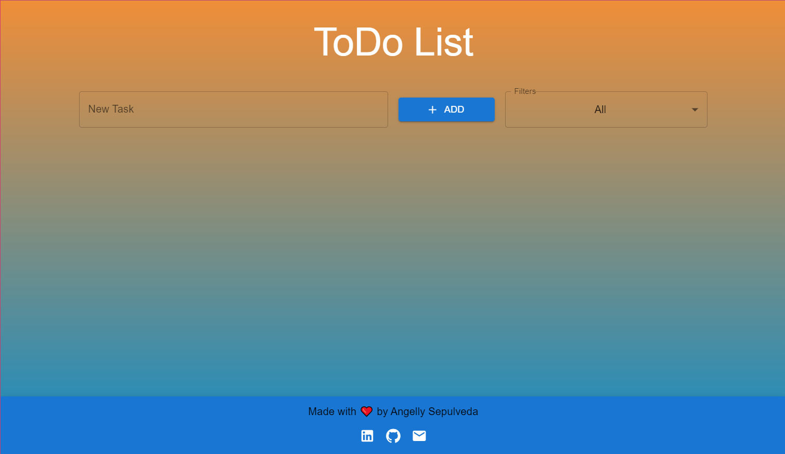
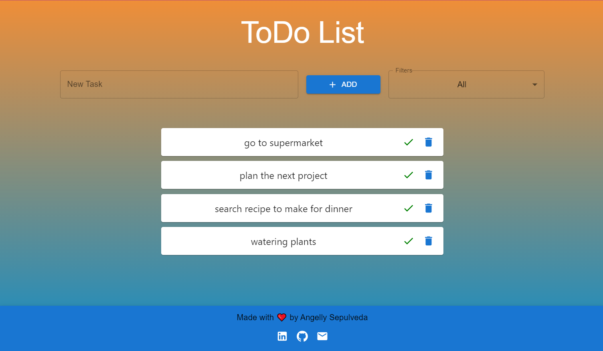

# ToDo List App

The Todo List application is a task management tool that allows users to organize their daily activities efficiently. With this application, users can add new tasks, mark tasks as completed, delete tasks they no longer need, and filter tasks according to their completion status. Additionally, the application is user-friendly and features a clean and modern interface, making it ideal for anyone looking to keep a clear and organized record of their pending tasks.

## Live Demo

You can access the live demo of this Todo List app [here](https://todo-list-tawny-omega.vercel.app/).
##

##

## Features

- **Add Tasks**: Easily add new tasks to your list.
- **Delete Tasks**: Remove tasks that are no longer needed.
- **Mark Tasks as Complete**: Mark tasks as complete when they're done.
- **Filter Tasks**: Filter tasks based on their completion status (All, Complete, Incomplete).

## Technologies Used

- React.js: A JavaScript library for building user interfaces.
- Material-UI: A popular React UI framework for building stylish and responsive user interfaces.
- Vercel: A cloud platform for hosting and deploying web applications.
##
The application was developed based on a model provided by Ada ITW, ensuring adherence to industry best practices and standards.
